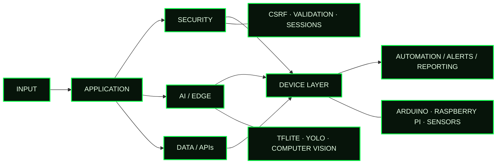

<div align="center">


<br/>

[](https://lamerock.github.io)
[](https://www.linkedin.com/in/gjpaglingayen)
[](https://github.com/lamerock?tab=followers)


</div>

---

## `> ./boot --profile lamerock`

```console
[ OK ] identity ............. G. J. P.
[ OK ] security module ...... application security / data protection
[ OK ] software module ...... full-stack / information systems
[ OK ] edge module .......... IoT / embedded / applied AI
[ OK ] delivery module ...... projects / governance / training
[ OK ] system status ........ ONLINE
```

**I build secure systems where software, devices, data, and real-world operations intersect.**

---

## `> ps -A | grep core_systems`

<table>
<tr>
<td width="50%" valign="top">

### `PID 01 // secure-workflow`

`APPSEC` · `FULL-STACK` · `2025`

Faculty document submission and requirements-management system with profiles, notifications, tracking, and approvals.

```text
CONTROLS
+ CSRF protection
+ centralized request validation
+ secure session workflows
+ protected state-changing operations
```

`PHP` · `MySQL` · `Bootstrap` · `JavaScript` · `PowerShell`

</td>
<td width="50%" valign="top">

### `PID 02 // edge-ai-irrigation`

`AI` · `ANDROID` · `IoT`

Rice-leaf nutrient assessment with on-device classification and automated irrigation control.

```text
PIPELINE
image
  -> CNN
  -> TensorFlow Lite
  -> Android / Kotlin
  -> HTTP
  -> Arduino Uno R4 WiFi
```

`Python` · `TensorFlow` · `Keras` · `Kotlin` · `TFLite` · `Arduino`

</td>
</tr>

<tr>
<td width="50%" valign="top">

### `PID 03 // automated-drying`

`EMBEDDED` · `AUTOMATION` · `2025`

Agricultural drying and monitoring system integrating environmental sensing, load measurement, relay control, GSM, and timed process logic.

```text
CONTROL LOOP
sense -> calculate
      -> decide
      -> actuate
      -> report
```

`Arduino/C++` · `DHT22` · `HX711` · `DS3231` · `GSM` · `Relays`

</td>
<td width="50%" valign="top">

### `PID 04 // realtime-vision`

`COMPUTER VISION` · `EDGE AI` · `RESEARCH`

Raspberry Pi system for automated raised-hand detection and real-time vote counting.

```text
MODEL     YOLOv5 / YOLOv8 nano
PLATFORM  Raspberry Pi
RESULT    82.6% mAP @ IoU 0.50:0.95
```

[DOI `10.69478/BEST2025v1n2a031` →](https://doi.org/10.69478/BEST2025v1n2a031)

</td>
</tr>
</table>

---

## `> cat /etc/system-architecture`



---

## `> systemctl status capabilities`

```text
● appsec.service        ACTIVE   CSRF · validation · auth/session · security testing
● privacy.service       ACTIVE   privacy · PIA · risk · incident coordination
● fullstack.service     ACTIVE   PHP · Laravel · React · Next.js · Flask · MySQL
● ai-edge.service       ACTIVE   TensorFlow · TFLite · YOLO · Android · Kotlin
● embedded.service      ACTIVE   Arduino · Raspberry Pi · sensors · GSM · relays
● delivery.service      ACTIVE   Git · GitHub Projects · Kanban · stakeholders
```

<div align="center">


</div>

---

## `> cat /var/log/impact.log`

```text
[2025]  commissioned secure full-stack system ............ COMPLETE
[2025]  commissioned embedded automation system .......... COMPLETE
[2024]  commissioned Android / ML / IoT system ........... COMPLETE
[2025]  AI / computer-vision publications ................ 2
[2020]  issued patent .................................... 1
[CV]    reported computer-vision result .................. 82.6% mAP
```

---

## `> tail -n 4 research.log`

| SIGNAL | ARTIFACT | STACK / RESULT |
|---|---|---|
| `2025 // PUBLISHED` | [Real-Time Automated Hand-Vote Counting System](https://doi.org/10.69478/BEST2025v1n2a031) | Raspberry Pi · YOLOv5 · YOLOv8 · `82.6% mAP` |
| `2025 // PUBLISHED` | [AIDeM: AI-based Dengue Mosquito Catching Device](https://doi.org/10.69478/BEST2025v1n2a032) | YOLOv8 · Raspberry Pi · MongoDB |
| `2021 // IEEE` | Deep Learning Application of Automated Facemask Classification and Physical-Distancing Detection | Deep Learning · Computer Vision |
| `2020 // PATENT` | Real-Time Flood Water Level Monitoring and Warning System | Patent No. `1/2020/050326` |

---

## `> cat /proc/operations`

```text
UNIVERSITY OF ANTIQUE
├─ Instructor, Computer Engineering .............. 2009–2025
│  └─ programming · software engineering · web · embedded · cybersecurity
│
├─ Director / OIC-Director, MIS .................. 2017–2019
│  └─ ICT planning · systems · projects · stakeholder coordination
│
├─ Director, Institutional Planning .............. 2018–2019
│  └─ planning · monitoring · institutional reporting
│
└─ Data Protection Officer ....................... 2019–2022
   └─ privacy compliance · PIA · incident coordination · privacy-by-design

DICT
├─ Python Programming Essentials ................. 2021
└─ Government Web Template Trainer ............... 2021
   └─ accessibility · deployment · hosting · security · SEO
```

---

## `> ls -lah ~/public`

<table>
<tr>
<td width="50%" valign="top">

### [`GPS-Impact-Detection-System`](https://github.com/lamerock/GPS-Impact-Detection-System)

`Arduino` · `C++` · `GPS` · `GSM`

Impact detection with SMS alerts and live-location reporting.

</td>
<td width="50%" valign="top">

### [`Flood-Detector`](https://github.com/lamerock/Flood-Detector)

`Arduino` · `C++` · `GSM` · `Ultrasonic`

Flood-level monitoring with automated SMS notification.

</td>
</tr>

<tr>
<td width="50%" valign="top">

### [`gwt-wordpress`](https://github.com/lamerock/gwt-wordpress)

`PHP` · `WordPress` · `GovTech`

Government Web Template implementation work.

</td>
<td width="50%" valign="top">

### [`LRTelDir`](https://github.com/lamerock/LRTelDir)

`C#` · `.NET`

Lightweight telephone-directory application.

</td>
</tr>
</table>

---

## `> git telemetry --user lamerock`

<div align="center">


<br/><br/>


</div>

---

<details>
<summary><code>> sudo cat /etc/credentials</code></summary>

<br/>

```text
2025  Computer Security Incident Handling Level 1 ........ TESDA
2024  Programming (Java) NC III .......................... TESDA
2019  Certified Data Protection Officer — DPO ACE L1 .... NPC
2017  Certified Secure Computer User v2 .................. EC-Council
2009  Civil Service Professional ......................... CSC
```

### `education`

- **Master of Engineering, Major in Computer Engineering** — Academic Requirements Completed, Western Institute of Technology
- **Bachelor of Science in Computer Engineering** — St. Anthony's College
- **Programming in C++ — 36-hour Short Course** — MFI Technological Institute

</details>

<br/>

<details>
<summary><code>> cat ~/.recent-training</code></summary>

<br/>

```text
2026  Data Privacy Awareness .............................. DICT
2026  Next.js App Router Fundamentals .................... Vercel
2025  Python Web Development with Flask .................. Ground Gurus
2025  Modern Web Applications with Laravel + React ....... Ground Gurus
2025  Laravel Fundamentals & Beyond ...................... Ground Gurus
2025  PHP Core & Object-Oriented Programming ............. Ground Gurus
2022  ISO/IEC 27001:2013 Internal Auditor Training ....... QRC
2021  Foundations of CERT Operations ..................... DICT
2021  Integrated Cybersecurity Management ................ DICT
2021  Digital Transformation ICT Project Management ..... DICT
```

</details>

---

<div align="center">

```text
root@lamerock:~$ echo $MISSION
BUILD_SECURE :: SOLVE_REAL_PROBLEMS :: KEEP_LEARNING
```

[Portfolio](https://lamerock.github.io) · [GitHub](https://github.com/lamerock) · [LinkedIn](https://www.linkedin.com/in/gjpaglingayen)

</div>
